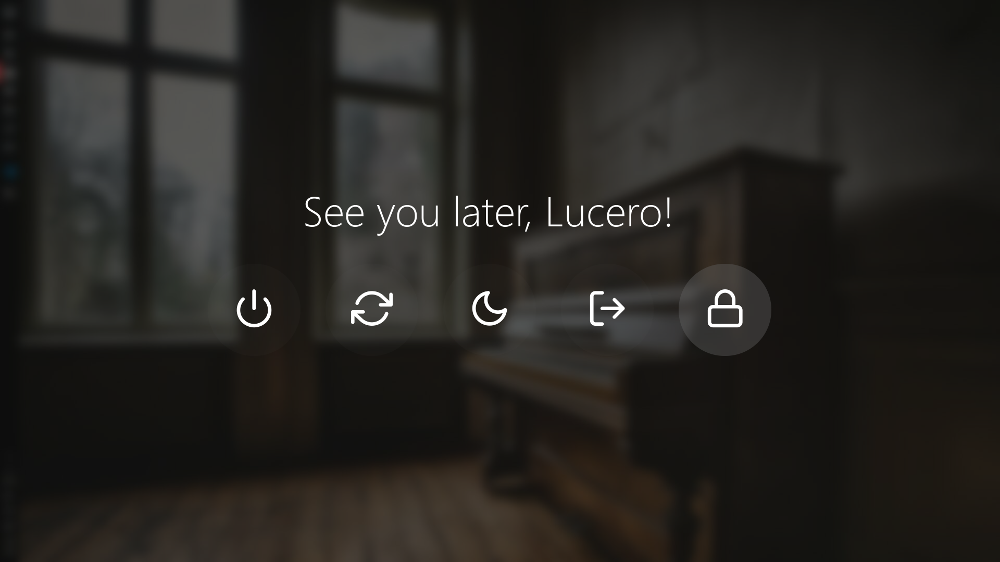
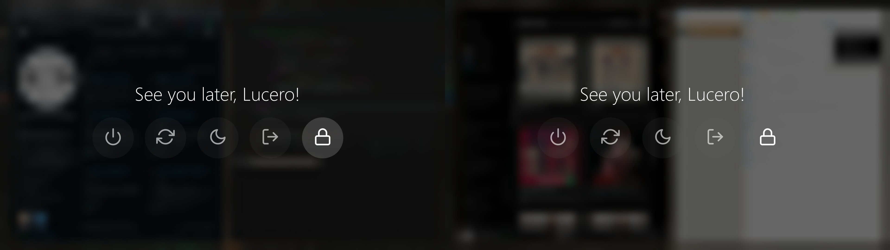

# Rofi Blurry Powermenu 




A simple yet beautiful powermenu made with [Rofi](https://github.com/davatorium/rofi), simulates a blur effect in the current screen.

- [Rofi Blurry Powermenu](#rofi-blurry-powermenu)
  - [Installation](#installation)
  - [Usage](#usage)
    - [From the terminal on Cinnamon, XFCE and Mate](#from-the-terminal-on-cinnamon-xfce-and-mate)
    - [Other Desktop Environments](#other-desktop-environments)
  - [Acknowledgments](#acknowledgments)

## Installation

Clone this repo in your `rofi` config folder
```bash
git clone https://github.com/lu0/rofi-blurry-powermenu.git ~/.config/rofi/blurry-powermenu
```

Link the script to your PATH
```bash
cd ~/.config/rofi/blurry-powermenu
sudo ln -srf powermenu.sh /usr/bin/blurry-powermenu
```

Install dependencies
```bash
sudo apt update && sudo apt install -y rofi scrot imagemagick
python3 -m pip install -r requirements.txt
```

Install included fonts
```sh
sudo cp fonts/* /usr/share/fonts/ && fc-cache -f
```


## Usage

### From the terminal on Cinnamon, XFCE and Mate

Trigger the powermenu, the `lock` option is highlighted by default.
```bash
blurry-powermenu
```

See the entire list of options
```bash
blurry-powermenu --help
```

### Other Desktop Environments
Depending on your system, there might be specific DE commands to lock your
screen and log out from the session. You may have to change the commands inside
the `case` statement of the script `powermenu.sh` for it to work on your system.

```bash
case $selected in
    "${poweroff}")
        systemctl poweroff
        ;;
    "${reboot}")
        systemctl reboot
        ;;
    "${sleep}")
        systemctl suspend
        ;;
    "${logout}")
        # DE specific
        ;;
    "${lock}")
        # DE specific
        ;;
esac
```

## Acknowledgments
This powermenu uses open source fonts
[Webly SleekUI](https://fonts2u.com/weblysleek-ui-semilight.font)
and
[Feather](https://github.com/feathericons/feather).

I compiled Feather using [my modified fork](https://github.com/lu0/svg-to-ttf)
of [rfbezerra's `svg-to-ttf` utility](https://github.com/rfbezerra/svg-to-ttf)
(which uses [Fontcustom](https://github.com/FontCustom/fontcustom))
to set the start of the character map.
