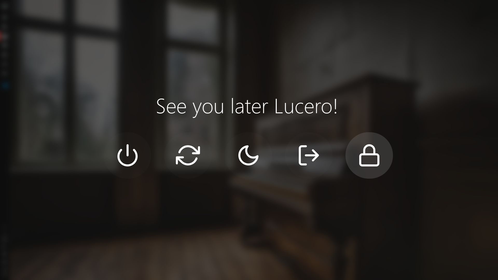
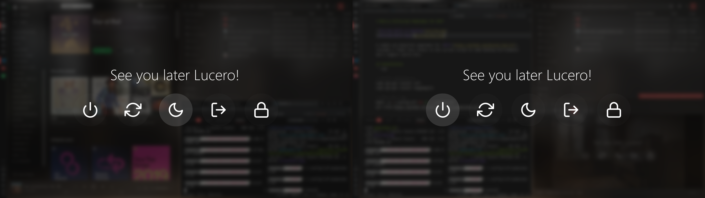

# Rofi Blurry Powermenu 




A simple yet beautiful powermenu made with [Rofi](https://github.com/davatorium/rofi). Includes a "fake" blur effect for the current screen.

## Installation

```zsh
# Clone repo
mkdir -p ~/.config/rofi && cd ~/.config/rofi
git clone --recurse-submodules https://github.com/lu0/rofi-blurry-powermenu.git

# Install dependencies and copy files
./rofi-blurry-powermenu/install-powermenu.sh
cd && rm -rf ~/.config/rofi/rofi-blurry-powermenu 
```

## Usage

### Cinnamon
Link it to the buttons of the Cinnamon Menu:
```zsh
cd ~/.config/rofi/
./replace-applet.sh
```
Or create a keybinding for the following command:
```zsh
~/.config/rofi/powermenu.sh
```
If you want to remove the powermenu from the Cinnamon Menu, run
```zsh
sudo xed /usr/share/cinnamon/applets/menu@cinnamon.org/applet.js
```
Replace all the code with the [default code](https://raw.githubusercontent.com/linuxmint/cinnamon/master/files/usr/share/cinnamon/applets/menu%40cinnamon.org/applet.js), and restart the applet by running
```zsh
dbus-send --session --dest=org.Cinnamon.LookingGlass --type=method_call /org/Cinnamon/LookingGlass org.Cinnamon.LookingGlass.ReloadExtension string:'menu@cinnamon.org' string:'APPLET'
```

### XFCE and MATE
Run the script or create a keybinding.
```zsh
~/.config/rofi/powermenu.sh
```

### Other Destop Environments
Depending on your system, there might be specific DE commands to lock your screen and log out from a session. You may have to change the commands inside the ```case``` statement of the script for the menu to work on your system.

```zsh
case $selected in
    $shutdown)
        systemctl poweroff     
        ;;
    $reboot)
        systemctl reboot              
        ;;
    $sleep)
        systemctl suspend   
        ;;
    $logout)
        # DE specific
        ;;
    $lock)
        # DE specific
        ;;
esac
```

## Notes
Tested under Rofi 1.5.4, Scrot 1.2 and ImageMagick 8:6.9.10.23 :)
