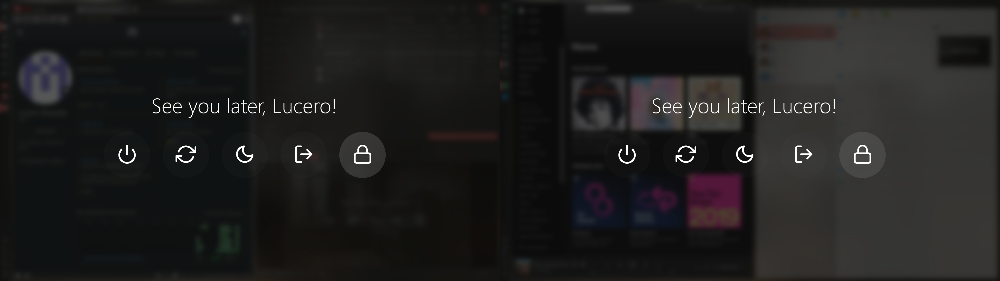

# Rofi Blurry Powermenu 




A simple yet beautiful powermenu made with [Rofi](https://github.com/davatorium/rofi). Includes a "fake" blur effect for the current screen.

## Installation
```zsh
# Install dependencies
sudo apt-get install rofi scrot imagemagick -y

# Clone this repo
mkdir -p ~/.config/rofi && cd ~/.config/rofi
git clone https://github.com/lu0/rofi-blurry-powermenu.git

# Copy only the neccesary files
cd rofi-blurry-powermenu
cp -r powermenu.sh fullscreen_powermenu.rasi ~/.config/rofi
sudo cp -r fonts/* /usr/share/fonts/

cd && rm -rf ~/.config/rofi/rofi-blurry-powermenu 
```

## Usage

### Cinnamon, XFCE and MATE
Run the script or create a keybinding.
```zsh
~/.config/rofi/powermenu.sh
```

### Other Destop Environments
Depending on your system, there might be specific DE commands to lock your screen and log out from a session. You may have to change the commands inside the ```case``` statement of the script for the menu to work on your system.

```zsh
case $selected in
    $shutdown)
        systemctl poweroff     
        ;;
    $reboot)
        systemctl reboot              
        ;;
    $sleep)
        systemctl suspend   
        ;;
    $logout)
        # DE specific
        ;;
    $lock)
        # DE specific
        ;;
esac
```

## Notes
Tested under Rofi 1.5.4, Scrot 1.2 and ImageMagick 8:6.9.10.23 :)
